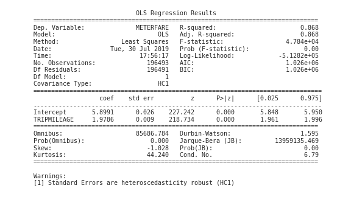
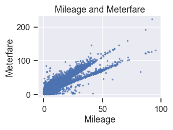

# Taxi in DC -To tip or not to tip, that is the question

## Objectives
Despite the popularity of Uber and Lyft, taxicabs are still relevant today. Unlike Uber or Lyft, taxicabs are able to accept cash, do not require a smartphone for reservations, and are easily identified on the streets. These differences allow taxicabs to remain in demand. Our objective is to analyze the taxi trips data in DC and figure out what determines the fares and tips.

## Contributors
Emefa Agodo and Keita Miyaki

## Dataset
We use "Taxicab Trips Sampling in July 2017" provided by the DC Government, which has 228,611 observations over July 23 to July 30, 2017. After the initial cleaning, we obtained 201,887 observations.

### Data Cleaning
We filtered out taxi trips with distances over 100 miles, total fares over 1,000 dollars, and trip durations over two hours. This was done because we aimed to analyze taxi trips in DC and adjacent areas and not include inter-regional trips. We also filtered out trips with average mileage per minute over 2 (we may see high numbers due to rounding errors of trip duration which is measured in minute, but believe numbers beyond 2 would be unreasonable).

## General Description of Dataset
The dataset after initial cleaning contained 201,887 observations. There were 36 variables associated with the observations. However, the variables used to help us with answering our objective were PROVIDER(taxicab company), TRIPTYPE(DDS, PSP, Transport-DC), METERFARE(how much the meter registered), TIP(how much tip was given), TOTALAMOUNT(total calculation of meterfare, surcharge, extras fees included, and tips), PAYMENTTYPE(cash, credit card, voucher), TRIPMILEAGE(distance travelled between pickoff location and dropoff location), TRIPTIME(total travel time), PICKUP_BLOCK_LONGITUDE(pickup longitude coordinate), PICKUP_BLOCK_LATITUDE(pickup latitude coordinate), DROPOFF_BLOCK_LONGITUDE(dropoff longitude coordinate), DROPOFF_BLOCK_LATITUDE(dropoff latitude coordinate), and AIRPORT(to or from airport). 

### Additional Variables Generated
The following columns were created to help with analysis: pickup_date(derived from pickupdatetime_tr column, only contains date in YYYY/MM/DD format), pickup_hour(derived from pickupdatetime_tr column, only contains hour in 24 hr format), dropoff_quadrant(derived from, dropoff_blockname column, areas of DC: NE, NW, SE, SW), distance_capitol(difference of mileage from capitol (using latitude, longitude coordinates to/from other locations), tipping(derived from tip column, 0 = no tip given, 1 = tip given).

## Analysis
Our analysis section comprizes three segments: OLS regression analysis of meterfare and trip mileage, logistic regression analysis of tipping probability, and time-series analysis of tipping probability.

### Meterfare and Trop Mileage
It is obvious that trip mileage is the most important determinant of meterfare. Simply regressing meterfare on trip mileage, we obtain a coefficient of 1.98 (US dollars) per mileage with a constant of 5.89 (US dollars).

Yet as the following scatter plot indicates, there are two distinct fitted lines with different slopes.

