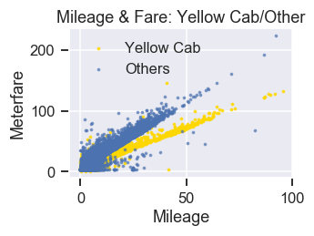
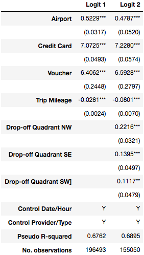
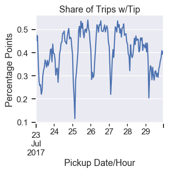

# Taxi in DC -To tip or not to tip, that is the question

## Objectives
Despite the popularity of Uber and Lyft, taxicabs are still relevant today. Unlike Uber or Lyft, taxicabs are able to accept cash, do not require a smartphone for reservations, and are easily identified on the streets. These differences allow taxicabs to remain in demand. Our objective is to analyze the taxi trips data in DC and figure out what determines the fares and tips.

## Contributors
Emefa Agodo and Keita Miyaki

## Dataset
We use "Taxicab Trips Sampling in July 2017" provided by the DC Government, which has 228,611 observations over July 23 to July 30, 2017. After the initial cleaning, we obtained 201,887 observations.

### Data Cleaning
We filtered out taxi trips with distances over 100 miles, total fares over 1,000 dollars, and trip durations over two hours. This was done because we aimed to analyze taxi trips in DC and adjacent areas and not include inter-regional trips. We also filtered out trips with average mileage per minute over 2 (we may see high numbers due to rounding errors of trip duration which is measured in minute, but believe numbers beyond 2 would be unreasonable).

## General Description of Dataset
The dataset after initial cleaning contained 201,887 observations. There were 36 variables associated with the observations. However, the variables used to help us with answering our objective were PROVIDER(taxicab company), TRIPTYPE(DDS, PSP, Transport-DC), METERFARE(how much the meter registered), TIP(how much tip was given), TOTALAMOUNT(total calculation of meterfare, surcharge, extras fees included, and tips), PAYMENTTYPE(cash, credit card, voucher), TRIPMILEAGE(distance travelled between pickoff location and dropoff location), TRIPTIME(total travel time), PICKUP_BLOCK_LONGITUDE(pickup longitude coordinate), PICKUP_BLOCK_LATITUDE(pickup latitude coordinate), DROPOFF_BLOCK_LONGITUDE(dropoff longitude coordinate), DROPOFF_BLOCK_LATITUDE(dropoff latitude coordinate), and AIRPORT(to or from airport). 

### Additional Variables Generated
The following columns were created to help with analysis: pickup_date(derived from pickupdatetime_tr column, only contains date in YYYY/MM/DD format), pickup_hour(derived from pickupdatetime_tr column, only contains hour in 24 hr format), dropoff_quadrant(derived from, dropoff_blockname column, areas of DC: NE, NW, SE, SW), distance_capitol(difference of mileage from capitol (using latitude, longitude coordinates to/from other locations), tipping(derived from tip column, 0 = no tip given, 1 = tip given).

## Analysis
Our analysis section comprizes three segments: OLS regression analysis of meterfare and trip mileage, logistic regression analysis of tipping probability, and time-series analysis of tipping probability.

### Meterfare and Trip Mileage
It is obvious that trip mileage is the most important determinant of meterfare. Simply regressing meterfare on trip mileage, we obtain a coefficient of 1.98 (US dollars) per mileage with a constant of 5.89 (US dollars).

Yet as the following scatter plot indicates, there are two distinct fitted lines with different slopes. It is not good enough to simply regress meterfare on trip mileage.

We figured out that service providers explain the difference in slopes of two groups, by adding a dummy variable for DC Yellow Cab company and its interaction term with trip mileage. A negative coefficient (-83 cents per mileage) on the interaction term indicates a flatter slope (1.41 dollars per mile) for Yellow Cabs than that for others (2.24 dollars per mileage) and is statistically significant.

In the following chart, DC Yellow Cab is represented by dots along with the flatter slope (yellow), and all other providers are represented by dots around the steeper slope (blue).

The truth would be, however, that DC Yellow Cab company reported trip mileage in kilometers instead of miles. Indeed, 1.41 dollars per km is equivalent to 2.26 dollars per mileage, which is almost identical to the others (2.24 dollars per mileage). We concluded it as a measurement error and corrected the trip mileage for Yellow Cab.

### Tipping Probability
To tip or not to tip, that is the question. Tipping is sometimes confusing; people sometimes tip and other times they don't. Within our sample group, slightly more than half of the observations came without tip. Among observations with tip the median tip-to-meterfare ratio is around 23%.

We examined the determinants of probability of tipping by logistic regressions and found following; customers are more likely to tip on a trip to or from airports; customers who pay by credit cards or vouchers are more likely to tip; the longer the ride is, the less likely customers tip. Adding quadrant dummy variables, the coefficient estimaters indicate trips with drop-off locations in Northwest, SouthEast, and Southwest are more likely with tips than those to Northeast.

Looking at the drop-off location plots of trips with tips and those without, we find a certain tendency that in Northeast and Southeast quadrants there are more no-tip rides around suburbs, while that trend is not obvious in Northwest. 

From longitude and latitude data, we calculated distance from the Capitol and included it in logistic regression model. Coefficient estimater of distance from the Capitol suggest that if the drop-off location is farther out from the city center, customers are less likely to tip. By including interaction terms of distance from the Capitol and quadrant dummies, we show that the distance from the center matters much less in Northwest quadrant in terms of likelihood of tipping than Northeast, and it matters more in Southeast quadrant. 

### Tipping Probability Time Series Analysis

We also looked at time-varying aspect of tipping probability. Plotting the probability of tipping by hour, we found that the customes look to be less likely to tip early in the morning everyday.

We decompose the observations into trend, seasonality, and error components, and we confirmed that a certain seasonality exists in the dataset.

We ran a SARIMA model with parameters specified by grid-searching. The regression result indicates some autoregressive and moving-avarage characteristics as well as seasonality components of the data.

